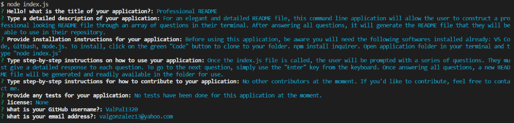

  # Professional README Generator

  

  ## Table of Contents
  * [Description](#description)
  * [Installation](#installation)
  * [Usage](#usage)
  * [Contribution](#contribute)
  * [Tests](#tests)
  * [Licenses](#licenses)
  * [Questions](#questions)
  
  ## Description
  For an elegant and detailed README file, this command line application will allow the user to construct a professional looking README file through an array of questions in their terminal. After answering all questions, it will generate the README file that they will be able to use in their repository.

  You can view an instructional video [HERE](https://drive.google.com/file/d/1OmBqFnAr55PFWfOnfiBCXiSOkUmkhURW/view).

  ## Installation
  Before using this application, be aware you will need the following softwares installed already: 
  * VS Code 
  * GitBash 
  * Node.js 
  
  - To install, click on the green "Code" button to clone to your folder 
  - npm install inquirer 
  - Open application folder in your terminal and type "node index.js" 

  ## Usage
  Once the index.js file is called, the user will be prompted with a series of questions. They must give a detailed response to each question. To go to the next question, simply use the "Enter" key from the keyboard. Once answering all questions, a new README file will be generated and readily available in the folder for use.

  Screenshot below for reference:
  
  
  ## Contribution
  No other contributors at the moment. If you'd like to contribute, feel free to contact me.

  ## Tests
  No tests have been done for this application at the moment.

  ## Questions
  Have any questions? Please feel free to reach out!  
  GitHub: https://github.com/ValPal1320  
  Email: valgonzalez13@yahoo.com
